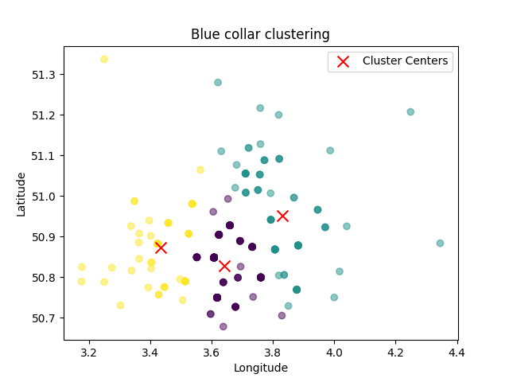
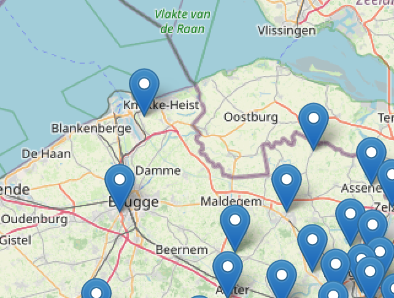

# GeospatialAnalysis

Installation

Clone the Repository
```
git clone <git url above>
```

Navigate to the Project Directory
```
cd GeospatialAnalysis
```

#### Install Dependencies
This command will install all the necessary Python packages listed in the requirements.txt file.
```
pip install -r requirements.txt
```
#### Place the Commuting Data CSV in the project directory
This is not synced through GitHub since it's a sensitive document.


####  Run the clustering code. 
```
python clustering.py
```
This will output the colored figures representing clusters, like so:




#### Generate an HTML of employee locations
```
python commuting_analysis.py
```
This creates a `employee_postal_numbers_map.html` file where you can visualize a map of employee locations, like the one below:


